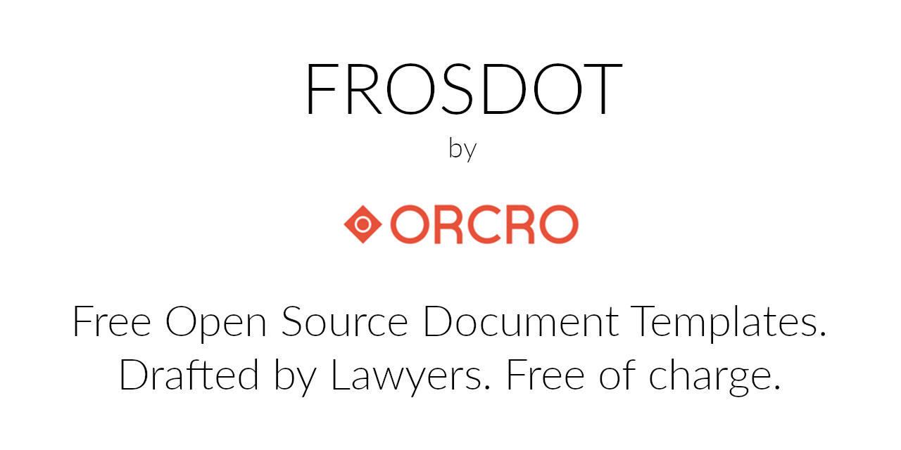

 This initiative has become the Eclipse Foundation project [Cardinal](https://gitlab.eclipse.org/eclipsefdn/emo-team/emo/-/issues/649). 

# FROSDOT

> Free, Open Source, (legal) Document Templates

## Quick start

## What?

## Why?

## Where next?

## Miscellanea

### Licensing

> For a full machine readable summary, please view `.reuse/dep5`.

The legal documents are all (currently) released under the CC0-1.0 or MIT licences (you can choose which, we suggest CC0 but some users may prefer a FLOSS licence).

Any code in this repository will be released under the Apache-2.0 licence.

Some of the graphics and branding are intellectual property of Orcro Limited and may not be reproduced (anything currently residing in RESOURCES/).

This repository also adheres to the REUSE specification, so if you have the appropriate tooling you can use the CLI to summarise things for you.

